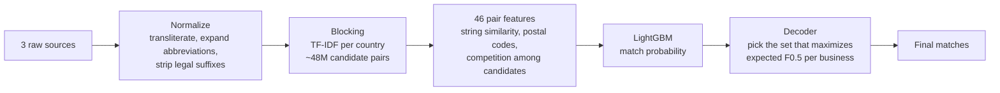

# Business Entity Resolution at Scale — Amazon ML Challenge 2026

**Matching millions of messy business records across three data sources, on a 16 GB laptop, in 3 days.**

| | |
|---|---|
| **Final score** | F0.5 = **0.93** on the leaderboard (validation 0.943) |
| **Progress** | 0.778 → 0.920 → 0.925 → 0.93 across four submitted versions |
| **Rank** | ~3,116 out of ~10,650 teams ~Top 30% of participating teams |
| **Team** | NC4 (4 members) |
| **Stack** | Python, pandas, scikit-learn (TF-IDF), RapidFuzz, LightGBM, anyascii |
| **Hardware** | Windows laptop, Intel i7, 16 GB RAM, CPU only |

---

## The problem

Large platforms receive information about the same business from many places, and the records never share an ID. One source says *"Sharma Traders Pvt Ltd, Near SBI ATM, MG Rd"*, another says *"SHARMA TRADERS PRIVATE LIMITED, Mahatma Gandhi Road, 400601"*, and a third has the name written in Devanagari. Deciding which records describe the same real business is called **entity resolution**.

The challenge gave three sources:

- **Source 1**: a clean reference list of businesses (1.7 million in the test set)
- **Sources 2 and 3**: noisy records, each of which matches at most one Source 1 business, or none (about 25% match nothing)

For every Source 1 business, the task was to list all its matching records from Sources 2 and 3.

**What made it hard:**
- **Noise everywhere**: abbreviations (Pvt / Private, Rd / Road), legal suffixes, typos, word reordering, landmark-based addresses, missing PIN codes, and names in Indian scripts.
- **Some names are gibberish**, so those records can only be matched by address.
- **Scale**: comparing every pair is impossible, so a candidate-generation ("blocking") step is required, and it caps the best achievable recall.
- **An unseen country**: training data covered the US and India, but the test set also included **France**.
- **A precision-heavy metric**: F0.5, averaged per business. A wrong merge costs about twice as much as a missed match, and predicting a match for a business that has none scores 0 for that business.
- **No external data**: no geocoding, APIs or lookups were allowed.

---

## Approach



**1. Normalization.** All text is transliterated to Latin script (so Hindi and Marathi names line up with their English spellings), lowercased, and cleaned. Legal suffixes are removed, and common address abbreviations are expanded.

**2. Blocking (candidate generation).** For each country separately, names and addresses are turned into TF-IDF vectors of words and word pairs. Each Source 1 business keeps its 20 most similar records, and each Source 2/3 record also nominates its 3 most similar Source 1 businesses (this "reverse" direction recovered matches the forward pass missed). This keeps **95.8%** of the true matches while reducing the comparisons to about 28 per business. Because blocking runs per country label, France needed no special handling.

**3. Features (46 per candidate pair).**
- *String similarity*: several RapidFuzz scores and TF-IDF cosine for names and addresses
- *Address details*: postal-code agreement or conflict, house-number match
- *Context*: how a candidate compares with the other candidates of the same business, how many Source 1 businesses share the same name, and whether a candidate looks like an even better fit for a different business

**4. Model.** A LightGBM classifier predicts the probability that each pair is a true match. Each Source 2/3 record is then assigned to at most one Source 1 business.

**5. Decoding for F0.5.** Instead of a single global probability cutoff, the final step chooses, for each business, the set of candidates with the highest *expected* F0.5 given the model's probabilities. This includes deciding confidently to predict "no match".

---

## How the score improved, and what I learned

| Version | What changed | Validation | Leaderboard |
|---|---|---|---|
| v1 | First end-to-end pipeline, 28 features | 0.962 | **0.778** |
| v2 | Rebuilt validation on full-size data | 0.79 | — |
| v3 | Better blocking: word pairs + reverse direction | 0.933 | 0.920 |
| v4 | Same-name ambiguity features (31 total) | 0.937 | 0.925 |
| v5 | 15 competition-aware features + F0.5 decoder (46 total) | 0.943 | **0.93** |

**The biggest lesson came from v1: the validation score was lying.** v1 scored 0.96 on validation but 0.78 on the leaderboard. The cause: to save time, I had validated on a 10% sample of the training data. With fewer businesses, each one had far fewer competing look-alike candidates, so the model looked much more precise than it really was. After rebuilding validation on the full-size data (v2), validation tracked the leaderboard to within about 1 point for every later version. That made each later improvement trustworthy before submitting.

**Error analysis decided v4 and v5.** Instead of guessing what to try next, I measured where the points were lost:
- Missed matches cost 0.035, wrong matches 0.018, and blocking misses 0.015 (so 0.985 was the ceiling).
- Records with an **empty address** were only 3.3% of the data but caused about a quarter of all errors.
- About half of the wrong matches were cases where **two different businesses had exactly the same name** and the model picked the wrong one.

v4 added features that measure that same-name ambiguity directly. v5 went further and made features *relative*: how much better a candidate is than the business's other candidates, and how it compares with its strongest rival. Those relative features turned out to be the most important in the final model.

**What didn't work:**
- An address-only blocking pass to recover the empty-name records. It added too many wrong candidates for the recall it gained, so it was not adopted.
- The F0.5 decoder gave a clear gain on v4, but almost nothing on v5 (+0.0001), because the v5 model's probabilities were already well separated. It was kept because it is never worse.

**Where the remaining gap is:** the top teams reached about 0.99. The largest remaining losses are missed matches and the 4.2% of true matches that blocking never surfaces, especially for Indian records (blocking recall 93.7% vs 97.2% for the US).

---

## Repository layout

```
src/
  normalize.py           text cleaning and transliteration
  blocking.py            TF-IDF candidate generation
  run_test_blocking.py   runs normalization + blocking on train or test
  features.py            31 base pair features + assignment + F0.5 metric
  features_v5.py         15 additional v5 features
  decode_f05.py          expected-F0.5 decoder
  predict_test_v5.py     final prediction script
  lgbm_v5.txt            trained final model
  explore.ipynb          exploration, error analysis, training
docs/
  REPRODUCE.md           exact commands to regenerate the submission
  METHODOLOGY.md         full technical write-up submitted to the challenge
```

The v4 version is kept as the git tag `v4`, and the final version as `v5`.

The challenge dataset is not included. To re-run the pipeline, see [docs/REPRODUCE.md](docs/REPRODUCE.md).

---

## Author

**Bhargavi S**
[LinkedIn](https://www.linkedin.com/in/ergocoder/)  
Email - ergo.bhargavi@gmail.com
